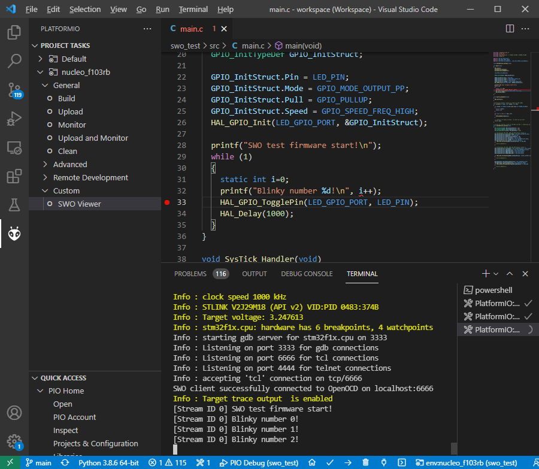
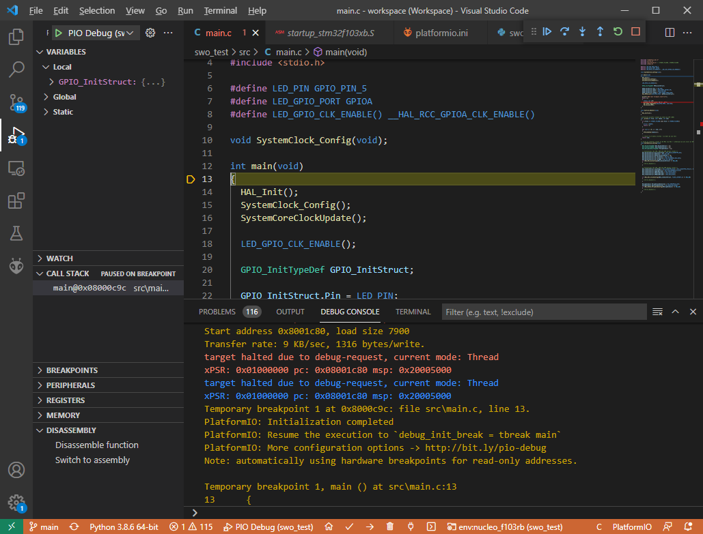
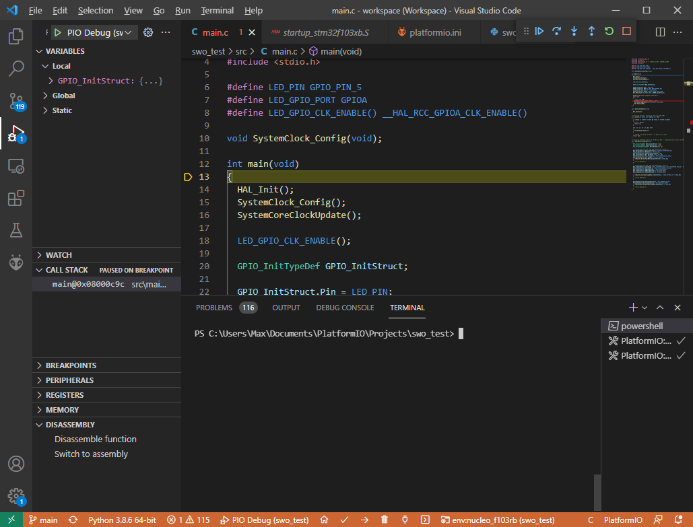
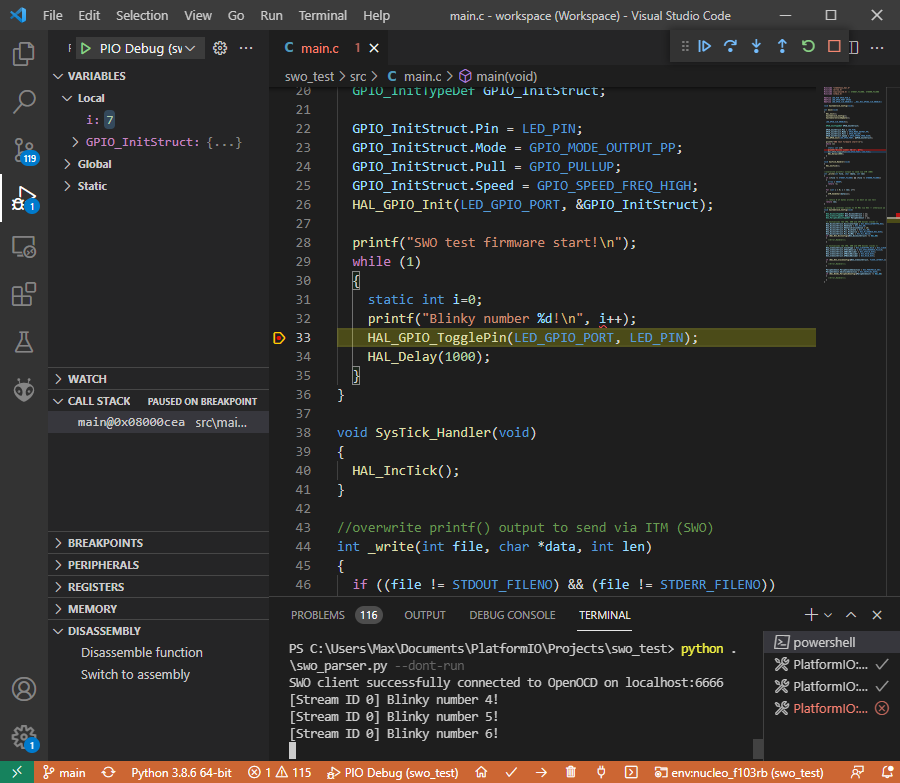

# PlatformIO + SWO Viewer Example

## Description 

This example shows a minimal firmware that redirects `printf()` output to go to the SWO (single-wire-out) port of the microcontroller.

The SWO port can then be connected to the SWO pin of an SWD-capabable debugger (e.g., an STLink). The STM32 Nucleo boards already have the on-board SWO pin of the ST-Link connected, so no extra hardware or wiring is needed.

The demo is written for an ST Nucleo-F103RB with its on-board STLink.

The main work has actually already been done by the people in this thread: https://community.platformio.org/t/viewing-swo-output-within-pio/13853

## Inner workings

OpenOCD is started in a configuration that opens a TCL server (port 6666) and forwards the SWO data to the TCL server.

The script found at https://github.com/robertlong13/SWO-Parser is used as the TCL client program which connectes to port 6666 and decodes the SWO streams. It was slightly adapted.

## Settings

**IMPORTANT:** Adapt the `platformio.ini` in regards to the 

```ini
swo_trace_clkin_freq = 64000000
```

and 

```py
  -c "nucleo_f103rb.tpiu configure -traceclk 64000000"
```

clock values. This **must** be the HCLK frequency / CPU frequency that the microcontroller is setup to run with in the firmware.

In this example, a clock init function initializes the high-speed internal (HSI) oscillator and PLL to run the microcontroller at 64 MHz. 

If your board runs at a different frequency, this value needs changing, or no output will be visible.

## Viewing SWO output normally

When a firmware has already been uploaded (via the normal "Upload" task) that uses the SWO output, the [project task](https://docs.platformio.org/en/latest/integration/ide/vscode.html#project-tasks) "Custom" -> "SWO Viewer" can be used to view the output.



When the SWO viewer is started, it will invoke OpenOCD to connect to the target microcontroller and setup the SWO port reading with the frequencies mentioned above. It will also restart the microcontroller using the OpenOCD `monitor reset run` command, so that output can be viewed from the beginning.

## Viewing SWO output during debugging

To enable viewing SWO output when debugging, a different approach must be taken: The `debug_server` must be changed to run OpenOCD in a configuration where the SWO output is read and a TCL server is started. This is already done in this project through the `platformio.ini`.

Then, debugging can be started normally



After the initial breakpoint at `main()` is hit, one needs to manually starts the `swo_parser.py` script to see the output. Click on the "TERMINAL" tab in VSCode and select the "powershell" session on the right. It should open a shell with the current directory being the project.



After that, start the `swo_parser.py` script using `python` and with `--dont-run` as an argument. The latter prevents the script from letting the microcontroller run, this would otherwise interfer with the VSCode debugging where the chip is halted at the breakpoint. 

If `python` is a globally accessible command, execute

```
python swo_parser.py --dont-run
```

If it is not, execute the command `pio system info` to find the "Python Executable" value and use that instead of `python`.

After that, the SWO output can again be seen.



## Restrictions

This example only works when OpenOCD is the debugging server. For JLink probes, the JLinkGDBServerCL program is used to create the GDB server. This example does not work with that.